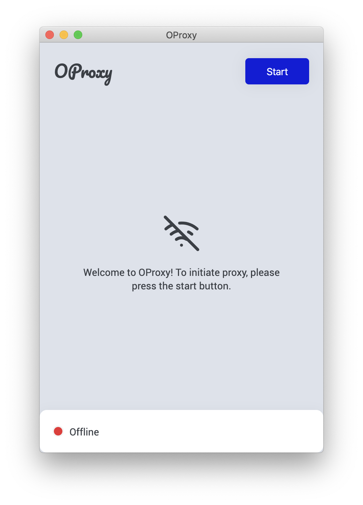
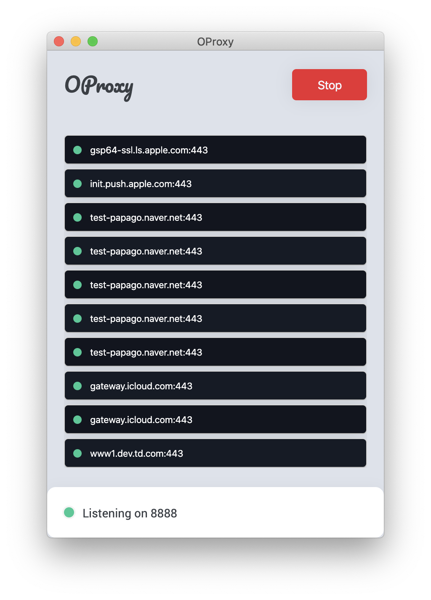

<!-- PROJECT LOGO -->
 

  

  <h3 align="center">OProxy</h3>

  

    A simple proxy application on Mac OS X
     
     
    ·
    <a href="https://github.com/yunibaek/oproxy/issues">Report Bug</a>
    ·
    <a href="https://github.com/yunibaek/oproxy/issues">Request Feature</a>
  

<!-- ABOUT THE PROJECT -->
## About The Project

    
    

### Built With

* [electron-react-boilerplate](https://github.com/electron-react-boilerplate/electron-react-boilerplate)

<!-- GETTING STARTED -->
## Getting Started

Download the `.dmg` file [here]()

<!-- ROADMAP -->
## Roadmap

See the [open issues](https://github.com/oproxy/yunibaek/issues) for a list of proposed features (and known issues).

<!-- CONTRIBUTING -->
## Contributing

Contributions are what make the open source community such an amazing place to be learn, inspire, and create. Any contributions you make are **greatly appreciated**.

1. Fork the Project
2. Create your Feature Branch (`git checkout -b feature/AmazingFeature`)
3. Commit your Changes (`git commit -m 'Add some AmazingFeature'`)
4. Push to the Branch (`git push origin feature/AmazingFeature`)
5. Open a Pull Request

<!-- LICENSE -->
## License

Distributed under the MIT License. See `LICENSE` for more information.

<!-- CONTACT -->
## Contact

Inseo Baek - [@inseo_baek](https://twitter.com/inseo_baek) - contact@inseobaek.com

